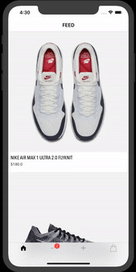
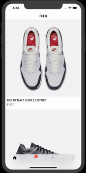

# NikeShop

### Nike E-Commerce App.

###### I developed a Nike Shopping App and i combined all the stuff that i wanted to learn. That means we have to deal with OOP, `UITableViewController`, `UITableViewCell`, `UIPageControl`, `UIPageViewController`, `UIPageViewControllerDataSource`, `UIPageViewControllerDelegate`, `UICollectionViewDataSource`, `UICollectionViewDelegate`, `UICollectionViewDelegateFlowLayout` and  `UICollectionViewCell`. I have to mention that only the first and the last tabs of `tabBar` are functional.

### App Stracture:

+ Set up `UIContainerView`
+ Embed `UIPageViewController` in `UIContainerView`
+ Set up `UIPageViewController`
+ Configure PageControl
+ Create image carousel
+ Set in `tabBar` a `badgeValue`

+ Using the `Dark Sky API`

---

+ Using the `Dark Sky API`

---

Tutorial Source: [David Tran](https://www.youtube.com/channel/UCvPFGq6luCqAVGiFpzTvkIA)

